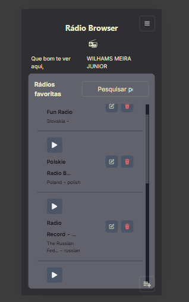
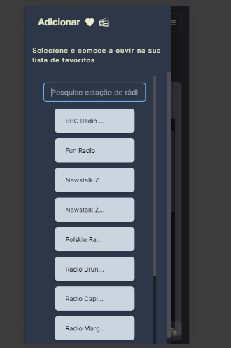
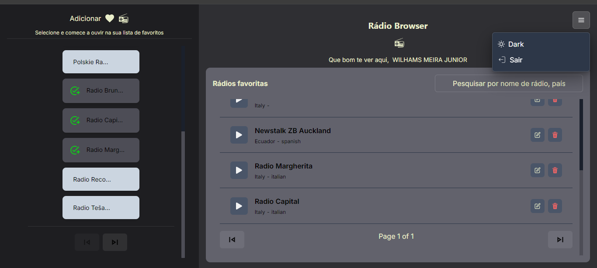

# Radio Browser Challenge

## Case

As pessoas estão com saudades de voltar nos tempos antigos e uma das melhores maneiras de solucionar esse problema é trazer a rádio de volta.
Sua tarefa para esse case será desenvolver uma aplicação que consuma uma API de rádio para que os usuários possam desfrutar e relembrar desse tempo, seguindo os requisitos propostos neste desafio.

# Radio Browser Challenge

## Introdução

Em um mundo cada vez mais digital, muitos de nós sentimos falta das antigas estações de rádio que acompanhavam nossos dias. Este projeto visa trazer de volta essa experiência, permitindo aos usuários explorar, adicionar e gerenciar suas rádios favoritas de maneira intuitiva e moderna. Desenvolvi uma aplicação que consome a API de rádio para oferecer uma experiência rica e escalável, utilizando as melhores práticas e tecnologias atuais.

## Tecnologias Utilizadas

- **Framework:** Next.js 14.2.5
- **Linguagem:** JavaScript (React)
- **Gerenciamento de Estado:** @reduxjs/toolkit, react-query
- **Estilização:** @chakra-ui/react, @emotion/react, @emotion/styled
- **Testes:** @testing-library/react
- **Autenticação:** Firebase
- **Outras Tecnologias:** framer-motion (para animações), react-icons

## Funcionalidades Implementadas

### Requisitos Obrigatórios

1. **Gerenciamento de Rádios:**
   - Adicionar rádios à lista de favoritos.
   - Visualizar lista de rádios adicionadas.
   - Remover rádios da lista de favoritos.
   - Editar informações da rádio selecionada.
   - Ouvir a rádio selecionada ao clicar em play.
   - Parar de ouvir a rádio ao clicar em stop.
   - Pesquisar rádios por nome, país ou idioma com paginação mostrando 10 rádios por vez.

2. **Persistência de Dados:**
   - Salvamento das informações para garantir que as rádios favoritas permaneçam disponíveis quando o usuário retornar à aplicação.

3. **Design Responsivo:**
   - Layout adaptado para dispositivos móveis e desktops, seguindo as boas práticas de UX e UI.

### Funcionalidades Extras (DIFERENCIAIS)

- **Testes Unitários e E2E:** Foram implementados testes para garantir a robustez da aplicação. (EM DOIS ARQUIVOS)
- **Publicação:** O projeto foi publicado em [Vercel](https://radio-online-v91w.vercel.app/) para acesso e visualização.

## Funcionalidades Adicionais

- **Autenticação com Firebase:** Permite um login seguro e a personalização da experiência do usuário.
- **Modo Dark e Light:** Oferece uma alternância entre temas claro e escuro para maior conforto visual.
- **Menu Mobile:** Implementação de um menu em drawer para uma navegação fluída em dispositivos móveis.
- **Experiência do Usuário (UX):** Tela intuitiva com mensagens informativas sobre o que está acontecendo no sistema.
- **Botão Mobile para Adicionar Músicas:** Facilita a adição de novas rádios diretamente pelo menu mobile.

## Paginação

**React Query** permite que você faça requisições de dados e gerencie o estado da aplicação de forma declarativa. Para a paginação, ele oferece uma abordagem simplificada que inclui:

1. **Cache de Dados:** React Query armazena em cache as respostas das requisições, o que reduz o número de chamadas à API e melhora a performance geral. Quando você navega entre páginas, os dados já carregados permanecem no cache e são reutilizados, evitando recarregamentos desnecessários.

2. **Sincronização Automática:** Com React Query, você pode configurar a sincronização automática dos dados, garantindo que sua aplicação esteja sempre atualizada com as informações mais recentes. Isso é especialmente útil para páginas que podem ser atualizadas com novos dados regularmente.

3. **Paginação e Fetching de Dados:** Utilizamos React Query para buscar dados paginados da API de forma eficiente. O React Query permite que você defina parâmetros de consulta para buscar apenas a página atual de dados. A abordagem inclui:
   - **Definir Query Keys:** Para cada página de dados, utilizamos uma chave única que inclui o número da página, garantindo que as requisições sejam feitas de forma adequada.
   - **Funções de Fetching:** Criamos funções que fazem as requisições à API com base na página atual e nos parâmetros de pesquisa.


## Imagens do Projeto

### Tela para Mobile



### Menu Mobile



### Tela para Desktop



## Instalação e Uso

1. **Clone o Repositório:**

   ```bash
   git clone https://github.com/seuusuario/radio-browser-challenge.git
   cd radio-browser-challenge
   npm install
   npm run dev e seja feliz :)
